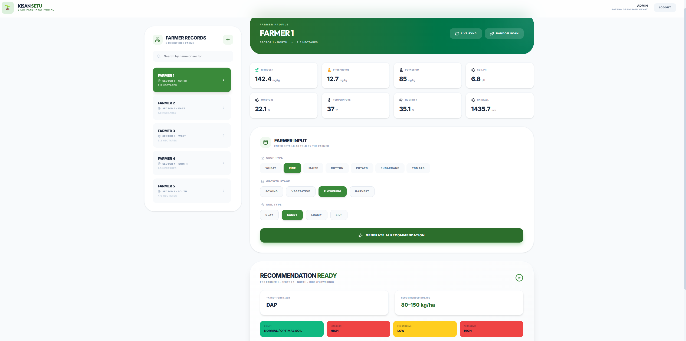
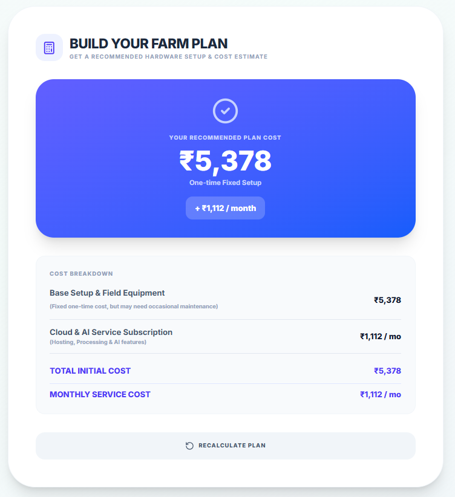

# KisanSetu-HiveX

> Advanced smart agriculture ecosystem utilizing ML, IoT telemetry, and Star Schema Data Warehousing for predictive analytics and role-based field management.

---

## About

KisanSetu-HiveX (v5.0) is a high-performance agricultural platform. It has evolved from a simple ML prediction module into an enterprise-grade analytics system with a dedicated Data Warehouse, Snowflake-style location hierarchy, and robust user authentication.

---

## What's in this repo

### v1.0 — ML Module (notebooks/)
The initial version focused on building the core intelligence layer — a machine learning model for fertilizer recommendation based on soil nutrient levels (NPK), pH, moisture, and crop type.

- `notebooks/RKdemy_Model_Building.ipynb` — model training, evaluation, and selection
- `notebooks/RKdemy_Fertilizer_Recommendation_Backend.ipynb` — backend logic and prediction pipeline

---

### v2.0 — Frontend UI Prototype (kisan-setu/)
A React-based dashboard prototype built for QuantHacks. All sensor data and recommendations were mocked — no backend connected.

---

### v3.0 — Full Stack Integration
The ML model is now connected to a live Flask backend. The frontend calls the real `/predict` API and displays actual model output — fertilizer recommendation, dosage, NPK status, pH status, and advisory notes.

---

### v4.0 — Gram Panchayat Module + New UI Features
Added role-based login (Farmer vs Gram Panchayat Operator), a full GP dashboard for managing multiple farmer records, Farm Plan Builder with cost estimator, soil type visual previews, and various UI improvements.

- `Kisan-Setu_Frontend/` — React + Vite + Tailwind frontend
- `Kisan-Setu_Backend/app.py` — Flask API serving the ML model
- `Kisan-Setu_Model_and_Encoders/` — trained Random Forest model + scikit-learn encoders
- `notebooks/RKdemy_Model_Building.ipynb` — model training, evaluation, and selection
- `notebooks/RKdemy_Fertilizer_Recommendation_Backend.ipynb` — backend logic and prediction pipeline

---

### v5.0 — Analytics Warehouse & Star Schema
A major architectural upgrade introducing a dedicated **Agricultural Data Warehouse**. Every recommendation is now logged as a "Fact" in a Star Schema, allowing for complex analytics across time, crop types, soil types, and regional hierarchies.

---

## Architecture (v5.0)

### 📊 Data Warehouse (Star Schema)
The backend now implements a formal Star Schema for agricultural intelligence:
- **Fact Table**: `fact_recommendation` — Central repository for every prediction event, capturing all sensor vectors and model outputs.
- **Reference Dimensions**: `dim_crop`, `dim_soil`, `dim_growth_stage`, `dim_fertilizer`.
- **Time Dimension**: `dim_time` — Granular tracking (Hour/Day/Month/Year) for seasonal trend analysis.

### 📍 Snowflake Location Hierarchy
Geographic data is organized into a scalable hierarchy:
- **Panchayat** (Gram Panchayat Level)
- **Sector** (Field/Block Level)
- **Farmer** (Individual Record)

### 📡 Telemetry & Auditing
- **Structured Audit Trail**: `telemetry_event` table logs system actions and data mode transitions.
- **X-Data-Mode**: Dual-stream processing for "Simulation" vs "Live" IoT telemetry, ensuring data integrity during testing.

---

## Pages

### Landing / Login
Role selection screen — Farmer login (direct access) or Gram Panchayat Operator login with credentials. Secure authentication for both with persistent sessions.


---

### Dashboard (Field Monitor)
Real-time field monitoring with sensor cards (soil moisture, pH, temperature, humidity), hydration & temperature trend charts, NPK balance, and system alerts.


---

### Optimization Protocol (ML Engine)
Select crop type, growth stage, and soil type — calls the Flask backend and returns a live fertilizer recommendation with dosage, NPK status, and advisory.


---

### IoT Live Mode
Switch between simulation and live IoT telemetry. When "Live Mode" is active, the system fetches real-time sensor data from the centralized warehouse facts for live field observation.


---

### Consumption Analytics
Monthly water usage bar chart and fertilizer NPK distribution pie chart.


---

### System Alerts
Sensor health alerts (critical / warning / info) with investigation notes and acknowledge actions.


---

### Gram Panchayat Dashboard
Operator view — manage multiple farmer records, view per-farmer sensor data, generate and export AI recommendations as text reports.



---

### Farm Plan Builder
Interactive cost estimator — answers a few questions about connectivity and power availability to recommend a hardware setup with cost breakdown.



---

## Features (v5.0)

- **Star Schema Warehouse** — Enterprise-ready analytics for agricultural data.
- **Audit Telemetry** — Full audit trail for every recommendation and system event.
- **Snowflake Location Mapping** — Regional data organization (Panchayat -> Sector).
- **Dual Flow Telemetry** — Isolated streams for Simulation and Live IoT data.
- **User Authentication** — Secure Bearer-token sessions with password hashing.
- **Voice UI Assistant** — Floating AI assistant interface (V5 UI Preview).
- **Live ML Inference** — Random Forest Classifier serving fertilizer recommendations via Flask
- **Animated UI** — Fluid transitions via Framer Motion
- **Fully Responsive** — Mobile-first design using Tailwind CSS v4

---

## Tech Stack

| Layer | Stack |
|---|---|
| **Frontend** | React 19, Vite 8, Tailwind CSS v4 |
| **Animations** | Framer Motion |
| **Charts** | Recharts |
| **Backend** | Python 3.10, Flask, SQLAlchemy |
| **Warehouse** | Star Schema (Fact/Dimension Architecture) |
| **ML Engine** | scikit-learn (Random Forest), Joblib |
| **Auth** | Secure Bearer Tokens |

---

## Run Locally

### 1. Environment Setup
```bash
# Activate the unified environment
conda activate RKdemy
```

### 2. Backend Initialization
```bash
cd Kisan-Setu_Backend
# Backend seeds the warehouse dimensions automatically on first run
python app.py
```
*Runs at `http://127.0.0.1:5001`*

### 3. Frontend Execution
```bash
cd Kisan-Setu_Frontend
npm install
npm run dev
```
*Runs at `http://127.0.0.1:5173`*

---

## Roadmap

- [x] ML model for fertilizer recommendation (notebooks/)
- [x] Frontend UI prototype
- [x] Flask backend + ML integration
- [x] Gram Panchayat dashboard + role-based login
- [x] Farm Plan Builder + cost estimator
- [x] Database integration (History & Telemetry)
- [x] User authentication (Secure sessions)
- [x] Updated Build Your Farm Plan Page with acutal researched data
- [ ] Dockerized Deployment (Compose)

---

> Built for QuantHacks. Leading the future of Decentralized Agricultural Intelligence.
