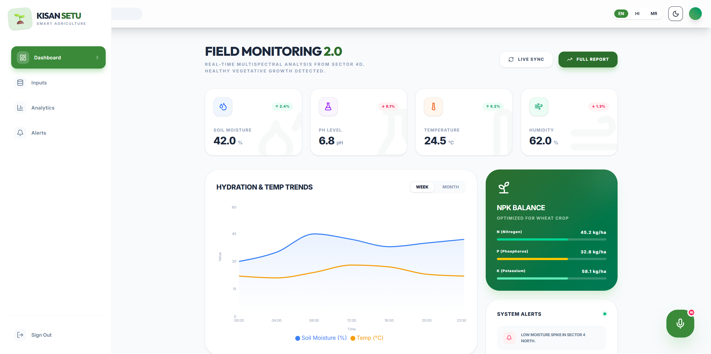
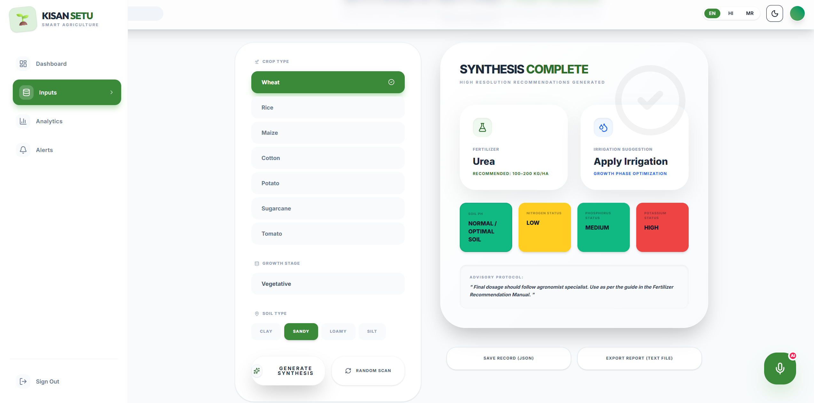
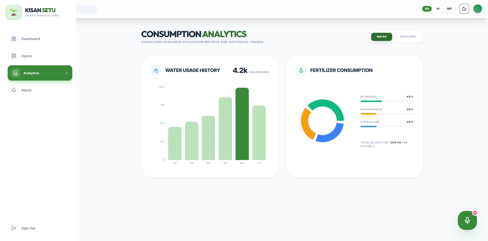
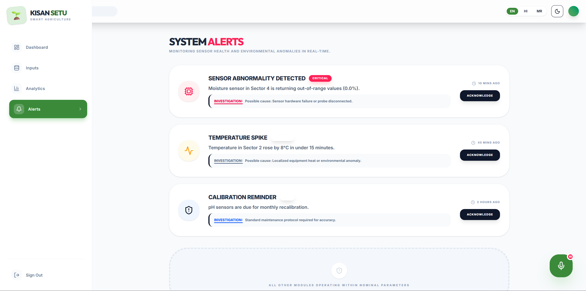

# KisanSetu-HiveX

> Offline-first smart agriculture system using ML and IoT concepts to provide fertilizer and irrigation recommendations based on soil and environmental data.

---

## About

KisanSetu is a full-stack smart farming platform (in progress). This repo tracks the evolution from an ML recommendation engine to a complete frontend dashboard.

---

## What's in this repo

### v1.0 — ML Module (notebooks/)
The initial version focused on building the core intelligence layer — a machine learning model for fertilizer recommendation based on soil nutrient levels (NPK), pH, moisture, and crop type.

- `notebooks/RKdemy_Model_Building.ipynb` — model training, evaluation, and selection
- `notebooks/RKdemy_Fertilizer_Recommendation_Backend.ipynb` — backend logic and prediction pipeline

---

### v2.0 — Frontend UI Prototype (kisan-setu/)
A React-based dashboard prototype built for QuantHacks. All sensor data and recommendations were mocked — no backend connected.

---

### v3.0 — Full Stack Integration
The ML model is now connected to a live Flask backend. The frontend calls the real `/predict` API and displays actual model output — fertilizer recommendation, dosage, NPK status, pH status, and advisory notes.

- `Kisan-Setu_Frontend/` — React + Vite + Tailwind frontend
- `Kisan-Setu_Backend/app.py` — Flask API serving the ML model
- `Kisan-Setu_Model_and_Encoders/` — trained Random Forest model + scikit-learn encoders
- `notebooks/RKdemy_Model_Building.ipynb` — model training, evaluation, and selection
- `notebooks/RKdemy_Fertilizer_Recommendation_Backend.ipynb` — backend logic and prediction pipeline

---

## Pages

### Dashboard
Real-time field monitoring with sensor cards (soil moisture, pH, temperature, humidity), hydration & temperature trend charts, NPK balance, and system alerts.



---

### Optimization Protocol (Inputs)
Select crop type, growth stage, and soil type — the form calls the Flask backend and returns a live fertilizer recommendation with dosage, NPK status, and advisory.



---

### Consumption Analytics
Monthly water usage bar chart and fertilizer NPK distribution pie chart.



---

### System Alerts
Sensor health alerts (critical / warning / info) with investigation notes and acknowledge actions.



---

## Features (v3.0)

- Live ML prediction via Flask API (`/predict`)
- Random Forest model with 7 crop types, 4 soil types, 4 growth stages
- Fertilizer recommendation + dosage + NPK + pH status returned from model
- Save record as JSON or export as text report
- Dark / Light mode toggle
- Animated page transitions via Framer Motion
- Floating AI Voice Assistant (UI only)
- Fully responsive layout with Tailwind CSS

---

## Tech Stack

| Layer | Stack |
|---|---|
| Frontend | React 19, Vite 8, Tailwind CSS v4 |
| Animations | Framer Motion |
| Charts | Recharts |
| Icons | Lucide React |
| Backend | Python, Flask, Flask-CORS |
| ML Model | Random Forest Classifier (scikit-learn) |
| Encoders | joblib, LabelEncoder |

---

## Run Locally

### 1. Backend
```bash
conda create -n RKdemy python=3.10 -y
conda activate RKdemy
pip install scikit-learn pandas numpy joblib flask flask-cors
python Kisan-Setu_Backend/app.py
```
Backend runs at `http://127.0.0.1:5000`

### 2. Frontend
```bash
cd Kisan-Setu_Frontend
npm install
npm run dev
```

---

## Roadmap

- [x] ML model for fertilizer recommendation (notebooks/)
- [x] Frontend UI prototype (kisan-setu/)
- [x] Flask backend + ML integration
- [ ] Live IoT sensor integration
- [ ] Data Logging and Retrieval
- [ ] Gram Panchayat Dashboard
- [ ] User authentication
- [ ] Docker Container

---

> Built as a hackathon prototype at QuantHacks. Backend + ML integration is the next step.
